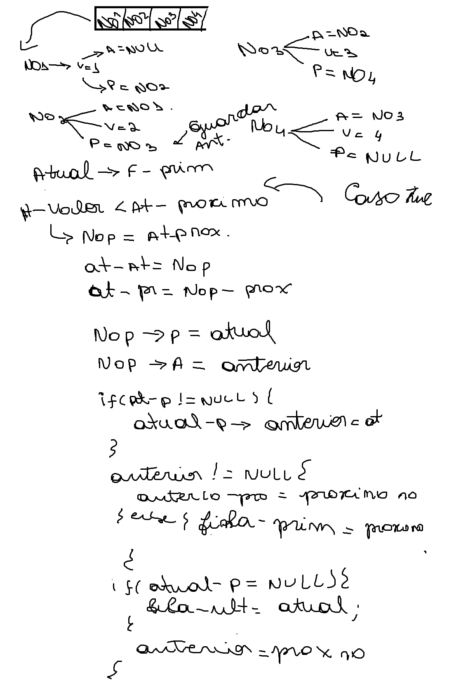

## Olá galera, como vão? 🖖🏽😊
Bem-vindos a mais um projeto em C! 💣💥

### Atualizações!
E aí, se é sua primeira vez aqui, gostaria de deixar você por dentro das novidades.
Dessa vez tive que implementar libs em c, manipulação de arquivos juntando com filas duplamente encadeadas, confira abaixo:
- Criação da lib fila.h com o arquivo fila.c: Responsável pelo TAD de filas.
- Edite o arquivo clientes.txt: Esse arquivo contem algumas idades pré-definadas para você testar "mais rápido" a ordenação.
Não esqueça de dar uma estrelinha ⭐⭐ 🤩

### Objetivo!
O que você verá por aqui?? Então, o objetivo era fazer a ordenação de uma "fila virtual" com base nas idades (maior para o menor) do tipo bubble sort, bem legal né?

## Mídias do Projeto!
### Processo criativo


## Como executar!

Primeiramente, verifique se o seu computador tem o compilador GCC instalado.
Caso não tenha, siga as dicas abaixo, no terminal do seu computador 👇🏽.

```bash

# •	Linux - Ubuntu ou Debian
$ sudo apt update
$ sudo apt install gcc

# •	Windows
$ wsl --install
$ sudo apt update
$ sudo apt install gcc

```
para executar o programa siga os comandos entre na pasta do projeto e rode o comando abaixo no seu terminal 👇🏽

```bash

$ gcc -o fila luanedossantoslopes.c fila.c
$ ./fila

```

##
<div align='center'>   
Criado por Luane dos Santos, aluna de Engenharia de Software na <a href="https://icomp.ufam.edu.br/">UFAM</a>, Profº  <a href="https://www.linkedin.com/in/juan-colonna-700bba56">Juan Colonna</a> da disciplina Algoritmos e Estrutura de Dados I.
</div>
